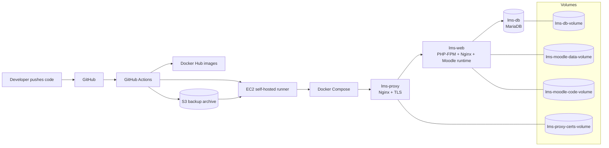

# devsecops-lms-deployment


## Overview

`devsecops-lms-deployment` is a containerized, production-oriented LMS deployment that runs a Moodle-based application behind an Nginx reverse proxy with MariaDB as the backing database. The repository is designed to solve the operational problem of deploying, updating, backing up, and restoring an LMS in a reproducible way while keeping the platform secure and automatable.

The stack is optimized for Docker Compose and a self-hosted GitHub Actions workflow. It builds a web image that bootstraps the LMS code, configures the runtime on container start, provisions TLS at the edge proxy, and provides repeatable backup/restore scripts for operational recovery.

## What This Repo Provides

- A three-tier Docker Compose deployment: database, web application, and reverse proxy.
- Automated web app initialization against MariaDB on first boot.
- Self-signed HTTPS termination at the proxy layer for local or internal deployments.
- Backup and restore tooling for database dumps, named volumes, and configuration files.
- GitHub Actions workflows for CI, container scanning, image publishing, deployment, bootstrap, backup, and restore.

## Architecture

This deployment follows a simple path: GitHub receives a change, GitHub Actions validates and builds the images, EC2 runs the containers, Docker isolates the services, and the LMS application serves traffic through Nginx.



### Runtime Flow

1. A browser hits `lms-proxy` on `80` or `443`.
2. The proxy terminates TLS and forwards requests to `lms-web` over the Docker bridge network.
3. `lms-web` runs PHP-FPM, serves the LMS code, and checks whether Moodle is already installed.
4. If the database is empty, the entrypoint runs the Moodle CLI installer against `lms-db`.
5. Moodle content, code, certificates, and database state persist in named Docker volumes.
6. Backups can be archived locally and optionally copied to S3 for off-host recovery.

## Tech Stack

- Docker Compose for orchestration.
- MariaDB 10.11 for the database layer.
- Ubuntu 24.04 for the LMS runtime image.
- PHP 8.3 with extensions required by the LMS application.
- Nginx for both the web runtime and the public reverse proxy.
- OpenSSL for generating self-signed proxy certificates.
- GitHub Actions for CI/CD and operational automation.
- AWS CLI for optional backup upload to S3.

## Repository Layout

```text
docker-compose.yml      # Main runtime topology and shared volumes/networks
app/Dockerfile         # Multi-stage build for the LMS web image
app/entrypoint.sh      # Runtime initialization, installer, and permission repair
proxy/Dockerfile       # Nginx reverse proxy image
proxy/entrypoint.sh    # TLS cert generation and proxy configuration
scripts/
	install-docker-aws-cli.sh  # Host bootstrap for Docker + AWS CLI
	lms-backup.sh              # DB dump + volume backup + optional S3 upload
	lms-restore.sh             # Restore DB, volumes, and env from a backup folder
	lms-setup.sh               # Legacy/manual server setup script
.env-example           # Sample production variables
.github/workflows/     # CI/CD, scanning, bootstrap, backup, restore
```

## Configuration

Create a `.env` file from `.env-example` and set real production values before deploying.

### Runtime Variables

| Variable | Used By | Purpose | Default / Notes |
| --- | --- | --- | --- |
| `DB_HOST` | `app/entrypoint.sh`, `docker-compose.yml` | Database hostname used by the LMS container | Defaults to `lms-db` |
| `DB_ROOT_PASS` | `docker-compose.yml`, backup/restore workflows | MariaDB root password | Required in production |
| `DB_NAME` | Compose, app container, workflows | Database name for the LMS schema | Default example: `moodle` |
| `DB_USER` | Compose, app container, workflows | Non-root database user | Default example: `moodleuser` |
| `DB_PASS` | Compose, app container, workflows | Password for `DB_USER` | Default example: `dbpassword!` |
| `WEBSITE_ADDRESS` | Compose, app entrypoint, proxy entrypoint, workflows | Public host name or IP used in `wwwroot`, `server_name`, and certificate SANs | Default example: `192.168.10.77`; runtime default is `localhost` |
| `PROTOCOL` | Compose, app entrypoint, workflows | LMS base URL scheme | Default example: `https://`; runtime default is `http://` |
| `IMAGE_TAG` | Compose, CI/CD workflows | Image tag used by `lms-web` and `lms-proxy` | Defaults to `latest`; deploy workflow uses short commit SHA |
| `SSL_CERT_DAYS` | `proxy/entrypoint.sh` | Validity period for generated self-signed certs | Default: `365` |
| `S3_BUCKET` | `scripts/lms-backup.sh`, backup workflow | Optional S3 bucket for archive upload | Script ships with an example bucket name; override for production |
| `S3_PREFIX` | `scripts/lms-backup.sh`, backup/restore workflows | S3 object prefix | Default: `lms` |
| `S3_KEEP_LAST` | `scripts/lms-backup.sh`, backup/restore workflows | Number of S3 backup archives to retain | Default: `3` |
| `LOCAL_KEEP_LAST` | `scripts/lms-backup.sh`, backup/restore workflows | Number of local backup folders and archives to retain | Default: `3` |
| `MYSQL_ROOT_PASSWORD` | MariaDB service container | Internal MariaDB root password variable mapped from `DB_ROOT_PASS` | Set by Compose |
| `MYSQL_DATABASE` | MariaDB service container | Internal MariaDB database name variable mapped from `DB_NAME` | Set by Compose |
| `MYSQL_USER` | MariaDB service container | Internal MariaDB user variable mapped from `DB_USER` | Set by Compose |
| `MYSQL_PASSWORD` | MariaDB service container | Internal MariaDB password variable mapped from `DB_PASS` | Set by Compose |

The app container also uses built-in defaults from the image when variables are omitted at runtime: `WEBSITE_ADDRESS=localhost`, `PROTOCOL=http://`, `DB_NAME=moodle`, `DB_USER=moodleuser`, and `DB_PASS=dbpassword!`.

### GitHub Actions Secrets

The workflows expect the following secrets to be configured in the repository or organization settings:

- `DOCKERHUB_USERNAME`
- `DOCKERHUB_TOKEN`
- `DB_ROOT_PASS`
- `DB_NAME`
- `DB_USER`
- `DB_PASS`
- `WEBSITE_ADDRESS`
- `PROTOCOL`
- `S3_BUCKET`
- `S3_PREFIX`
- `S3_KEEP_LAST`

The backup and restore workflows also require a self-hosted runner with Docker and AWS CLI access.

## Local Setup

1. Install Docker Engine and Docker Compose v2.
2. Clone the repository.
3. Create your runtime file: `cp .env-example .env`.
4. Update `.env` with strong secrets and the correct public address or local host name.
5. Start the stack: `docker compose up -d --build`.
6. Wait for the LMS installer to finish on first boot.
7. Open `https://<WEBSITE_ADDRESS>` in a browser and accept the self-signed certificate if you are not using a trusted certificate yet.

Example local commands:

```bash
cp .env-example .env
docker compose up -d --build
docker compose ps
docker compose logs -f lms-web
```

## Production Setup

1. Provision a Linux host or VM with at least Docker, Docker Compose v2, and outbound network access to your image registry and optional S3 bucket.
2. Point `WEBSITE_ADDRESS` at the host's public IP or DNS name and open inbound `80` and `443`.
3. Set production credentials in `.env` or in GitHub Actions secrets; never commit secrets to the repository.
4. If you want the convenience bootstrap, run `scripts/install-docker-aws-cli.sh` on the host or install Docker and AWS CLI using your standard hardening baseline.
5. Start the stack with `docker compose up -d --build`.
6. For automated delivery, configure a self-hosted GitHub Actions runner on the target host and use the deploy workflow to refresh images and restart the stack.
7. Replace the self-signed certificate flow with a trusted certificate strategy if the site is publicly reachable.

Recommended production launch commands:

```bash
docker compose pull
docker compose up -d --force-recreate --pull always
```

## CI/CD Pipeline

The deployment pipeline is intentionally simple:

`Code push or manual dispatch` -> `validate` -> `build` -> `scan` -> `push` -> `deploy`

### Step-by-Step Flow

1. A developer pushes code, triggers `repository_dispatch`, or starts `workflow_dispatch` manually.
2. `ci-cd-pipeline.yml` acts as the orchestrator and calls the reusable CI jobs.
3. `ci-secret-scan.yml` checks the repo and git history for leaked secrets using Gitleaks and TruffleHog.
4. `ci-shell-script-scan.yml` runs ShellCheck over every script in `scripts/`.
5. `ci-dockerfile-scan.yml` runs Hadolint on both Dockerfiles to catch bad image patterns.
6. `ci-build-scan-push.yml` builds the `lms-web` and `lms-proxy` images, scans them with Trivy, and pushes tagged images to Docker Hub.
7. `cd-deploy.yml` runs on the self-hosted EC2 runner, exports the deployment secrets, and refreshes the stack with Docker Compose.
8. `app/entrypoint.sh` starts the web container, waits for MariaDB, and auto-installs Moodle if the schema does not exist.
9. If backups are enabled, `ops-backup.yml` or `scripts/lms-backup.sh` creates SQL dumps and volume archives, then uploads them to S3.
10. If recovery is needed, `ops-restore.yml` downloads the latest archive from S3 and rehydrates the compose volumes and database.

### Workflow Roles

| Workflow file | Role in the pipeline |
| --- | --- |
| `.github/workflows/ci-cd-pipeline.yml` | Main orchestrator that chains validation, build, and deploy. |
| `.github/workflows/ci-secret-scan.yml` | Secret detection and history scanning. |
| `.github/workflows/ci-shell-script-scan.yml` | Bash linting for operational scripts. |
| `.github/workflows/ci-dockerfile-scan.yml` | Dockerfile linting and image best-practice checks. |
| `.github/workflows/ci-build-scan-push.yml` | Build, Trivy scan, and push container images to Docker Hub. |
| `.github/workflows/cd-deploy.yml` | Redeploy the stack on EC2 using Docker Compose. |
| `.github/workflows/ops-bootstrap.yml` | Prepare the runner with Docker and AWS CLI. |
| `.github/workflows/ops-backup.yml` | Run the backup script and ship the archive to S3. |
| `.github/workflows/ops-restore.yml` | Restore the stack from the latest S3 backup. |

### How Docker, AWS, and Scripts Work Together

- Docker builds and runs the application, database, and proxy containers.
- GitHub Actions builds and scans the images before deployment.
- AWS S3 stores backup archives for off-host recovery.
- `scripts/lms-backup.sh` creates the backup package.
- `scripts/lms-restore.sh` rehydrates the stack from that package.
- `scripts/install-docker-aws-cli.sh` prepares the runner host for Docker and AWS CLI operations.

The deploy workflow sets `IMAGE_TAG` to the short Git commit SHA, then runs `docker compose down && docker compose up -d --force-recreate --pull always` on the target host.

### Workflow Matrix

| Workflow file | Trigger | Jobs | What it does |
| --- | --- | --- | --- |
| `.github/workflows/ci-cd-pipeline.yml` | `repository_dispatch` with `lms-app-updated`, `workflow_dispatch` | `secret-scan`, `shell-script-scan`, `dockerfile-scan`, `build-scan-push`, `deploy` | Orchestrates the end-to-end CI/CD chain and hands off to deployment after successful validation and image publishing. |
| `.github/workflows/ci-secret-scan.yml` | `workflow_call` | `secret-scan` | Checks code and git history with Gitleaks and TruffleHog. Skips Gitleaks on `repository_dispatch` events to avoid false-positive behavior in that path. |
| `.github/workflows/ci-shell-script-scan.yml` | `workflow_call` | `shell-script-scan` | Runs ShellCheck on all scripts under `scripts/`. |
| `.github/workflows/ci-dockerfile-scan.yml` | `workflow_call` | `dockerfile-scan` | Runs Hadolint against `app/Dockerfile` and `proxy/Dockerfile`. |
| `.github/workflows/ci-build-scan-push.yml` | `workflow_call` | `build-scan-push` | Sets Docker Hub metadata, builds both images, scans them with Trivy for critical/high CVEs, then pushes tagged images to Docker Hub. |
| `.github/workflows/cd-deploy.yml` | `workflow_call` | `deply` | Checks out the repository on a self-hosted runner, exports the deployment secrets, and recreates the compose stack with fresh images. |
| `.github/workflows/ops-bootstrap.yml` | `workflow_dispatch` | `setup-runner` | Installs Docker and AWS CLI on the runner host, then verifies the install. The install step is allowed to fail without aborting the workflow because the host may reboot. |
| `.github/workflows/ops-backup.yml` | `workflow_dispatch` | `backup` | Writes secrets into `/home/ubuntu/.env`, copies the repo to the runner workspace if needed, and executes `scripts/lms-backup.sh`. |
| `.github/workflows/ops-restore.yml` | `workflow_dispatch` | `restore` | Finds the latest backup object in S3, downloads and extracts it, exports deployment variables, and runs `scripts/lms-restore.sh`. |

### Deployment Flow

1. A repository dispatch event or manual workflow dispatch triggers `ci-cd-pipeline.yml`.
2. Secret scanning runs first, followed by ShellCheck and Hadolint.
3. The build job creates image tags from the commit SHA and `latest`, then builds the web and proxy images.
4. Trivy scans the freshly built images for critical and high CVEs.
5. If the image scan passes, both images are pushed to Docker Hub.
6. The deploy workflow runs on the self-hosted runner, exports the deployment variables, and refreshes the stack with `docker compose down && docker compose up -d --force-recreate --pull always`.
7. On first boot or after a database reset, the web container detects a missing Moodle schema and performs the CLI installation automatically.

## Backup and Restore

### Backup

`scripts/lms-backup.sh` creates a timestamped backup folder under `/opt/lms-backups`, dumps the MariaDB database, archives the named Docker volumes, copies `docker-compose.yml`, and optionally uploads the final archive to S3.

It also supports retention cleanup through `LOCAL_KEEP_LAST` and `S3_KEEP_LAST`.

Example:

```bash
sudo -E ./scripts/lms-backup.sh
```

### Restore

`scripts/lms-restore.sh <backup_dir>` restores the `.env` file, recreates the compose volumes, fixes ownership and permissions, restores the database from `mariadb.sql.gz` or `mariadb.sql`, and then brings the stack back up.

Example:

```bash
sudo ./scripts/lms-restore.sh /opt/lms-backups/2026-04-18_09-52-15
```

## Example Commands

```bash
# Start or refresh the stack
docker compose up -d --build

# Follow web container logs
docker compose logs -f lms-web

# Stop the stack
docker compose down

# Run a manual backup
sudo -E ./scripts/lms-backup.sh

# Restore from a backup folder
sudo ./scripts/lms-restore.sh /opt/lms-backups/<timestamp>
```

## DevSecOps Practices

This repository follows a few practical DevSecOps controls that are visible in the codebase:

- Secrets are expected from `.env` locally and GitHub Actions secrets in CI/CD; the repository does not hardcode production credentials.
- The database is isolated on a private Docker bridge network and is not exposed on public ports.
- The deploy path runs on a self-hosted runner, which keeps runtime credentials and deployment access close to the EC2 host.
- The pipeline includes Gitleaks, TruffleHog, ShellCheck, Hadolint, and Trivy to catch secret leaks, script mistakes, Dockerfile issues, and image CVEs.
- The backup flow can use S3 with explicit retention settings, so recovery artifacts are kept outside the main host.
- The web container drops into a controlled install path and repairs permissions before serving traffic, reducing drift after restore or upgrade.

Recommended hardening steps:

- Use long random values for all database and workflow secrets.
- Grant the S3 IAM principal only the minimum permissions required for backup and restore.
- Restrict EC2 inbound access to `80` and `443`; keep database access internal only.
- Replace self-signed certificates with a trusted certificate strategy for public deployments.
- Review and rotate workflow secrets after each incident, migration, or team change.

## Security Best Practices

- Replace all sample passwords in `.env-example` with long, unique secrets.
- Keep `.env` out of version control and restrict file permissions to the deployment user.
- Use a trusted TLS certificate for public production traffic instead of the generated self-signed certificate.
- Restrict inbound network access to ports `80` and `443` only, and keep the database private on the Docker network.
- Use least-privilege AWS credentials if S3 backup upload is enabled.
- Review Docker Hub and GitHub Actions secrets regularly and rotate them after any incident or personnel change.
- Treat the backup archive as sensitive because it contains database dumps and application data.

## Troubleshooting

### Deployment failures

- Check whether `ci-secret-scan.yml`, `ci-shell-script-scan.yml`, or `ci-dockerfile-scan.yml` failed before the deploy job started.
- Confirm the Docker Hub secrets are valid and that the images can be pushed.
- If the deploy job runs on EC2, verify the self-hosted runner is online and still registered.

### Docker issues

- Run `docker compose ps` to confirm all services are up.
- Use `docker compose logs -f lms-web` and `docker compose logs -f lms-proxy` to inspect container startup errors.
- Rebuild the stack with `docker compose up -d --force-recreate --pull always` if image tags changed.

### Permission issues on AWS / EC2

- Ensure the EC2 instance role or IAM user has permission to read and write to the configured S3 bucket.
- Confirm the runner user can execute Docker commands and access the workspace files.
- If backup or restore fails, verify that `/opt/lms-backups` exists and is writable.

### Environment variable mistakes

- Make sure `.env` contains matching values for `DB_ROOT_PASS`, `DB_NAME`, `DB_USER`, `DB_PASS`, `WEBSITE_ADDRESS`, and `PROTOCOL`.
- Check that the same values are configured in GitHub Actions secrets for the deployment workflows.
- Remember that `WEBSITE_ADDRESS` must match the browser URL or public IP you are actually using.

### The site does not load

- Confirm `WEBSITE_ADDRESS` matches the domain or IP you are using in the browser.
- Check that ports `80` and `443` are open on the host and security group.
- Inspect the proxy logs with `docker compose logs -f lms-proxy`.

### HTTPS shows a certificate warning

- The proxy generates a self-signed certificate on first start if no certificate exists.
- Use a trusted certificate for public access or temporarily accept the self-signed cert for internal testing.

### Database connection or installer failures

- Verify that `DB_ROOT_PASS`, `DB_NAME`, `DB_USER`, and `DB_PASS` match across `.env`, the compose file, and any workflow secrets.
- Confirm the MariaDB container is healthy and reachable as `lms-db` on the internal network.
- Re-run the stack after fixing the environment file: `docker compose up -d --force-recreate`.

### Uploaded files or logos are missing after restore

- Use the provided restore script, not a raw volume copy, because it re-applies ownership and permissions.
- Run the restore from the repository root so Docker Compose resolves the same project name and volume names.

### Backups do not upload to S3

- Confirm the AWS CLI is installed and authenticated on the host or runner.
- Verify `S3_BUCKET`, `S3_PREFIX`, and the IAM permissions allow `s3:PutObject`, `s3:ListBucket`, and `s3:DeleteObject` for retention cleanup.

### The web container never finishes booting

- Check whether the database has started and accepted the configured credentials.
- Review `docker compose logs -f lms-web` for installer output and permission errors.

## Notes

- The web image is built from `app/Dockerfile` and clones the LMS application source during image build, so rebuilding the image is required when the application code changes.
- The repo currently ships a Docker Compose deployment and GitHub Actions automation, not Kubernetes manifests.
- The legacy `scripts/lms-setup.sh` script is still present for manual server setup, but the Compose-based flow is the recommended operational path.

## Contributing

1. Fork the repository and create a feature branch.
2. Make focused changes and keep operational scripts executable.
3. Validate Dockerfiles, shell scripts, and workflows before opening a pull request.
4. Update the README if you change configuration, deployment, or operational behavior.
5. Keep secrets out of the repository and use GitHub Actions secrets or `.env` for runtime values.

Suggested validation commands:

```bash
docker compose config
shellcheck scripts/*.sh
hadolint app/Dockerfile proxy/Dockerfile
```

## License

This project is licensed under the MIT License. See [LICENSE](LICENSE) for the full text.
